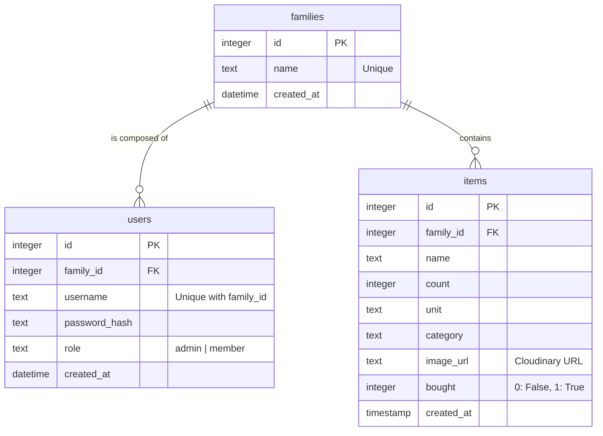

# Entity Relationship Diagram

Family Shopper アプリケーションのデータベース構造です。
Cloudflare D1 (SQLite) を使用しています。

## テーブル詳細

### families
家族グループを管理します。
- `name`: 家族の表示名（例：松谷家）。

### users
各家族に所属するメンバー情報を管理します。
- `family_id`: 所属する家族への参照。
- `username`: 家族内においてユニークである必要があります。
- `role`: 家族の作成者（管理者）は `admin`、追加されたメンバーは `member` となります。

### items
家族ごとの買い物リストアイテムを管理します。
- `family_id`: どの家族のリストかを示す参照。
- `image_url`: Cloudinaryにアップロードされた画像の絶対URL。
- `bought`: 購入済みフラグ。
