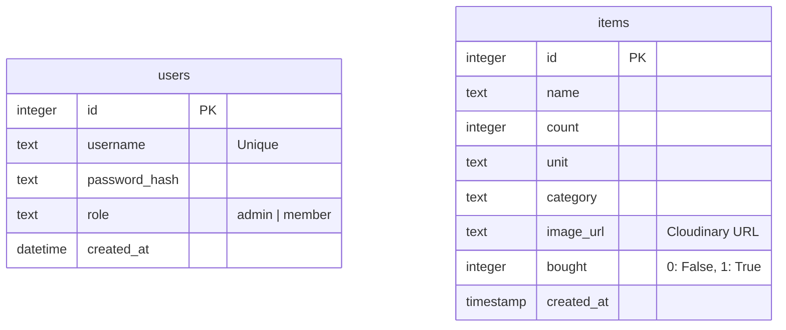

# Entity Relationship Diagram

Family Shopper アプリケーションのデータベース構造です。
Cloudflare D1 (SQLite) を使用しています。

## テーブル詳細

### users
家族メンバー情報を管理します。
- `role`: 管理者(`admin`)はユーザー追加が可能、家族メンバー(`member`)はアイテムの管理のみ可能です。

### items
お買い物リストのアイテムを管理します。
- `image_url`: Cloudinaryにアップロードされた画像の絶対URLが格納されます。
- `bought`: 購入済みフラグ。JSX/JS側で `true/false` として扱われます。
